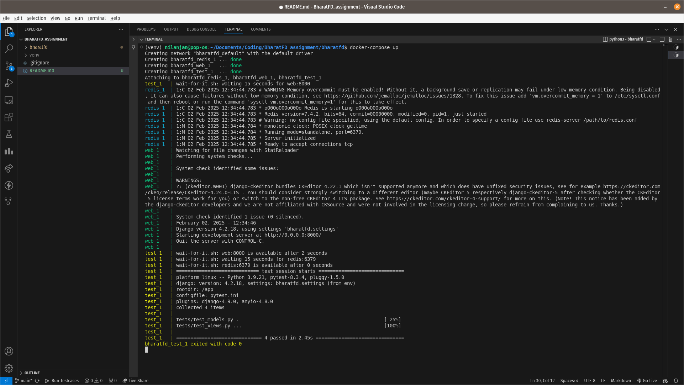

Hello! This is my submission of the BharatFD Backend Assignment. I believe I have been able to complet all the tasks and requirements that were demanded from the assignment. Lets take a look at how this works.

The Tech stack that I used:
1. Backend: Django
2. Database: SQLite3 (In-memory)
3. Caching: Redis
4. Containerization: Docker


Some assumptions I made: 
1. I did not use a .env file to store the secret-key since it would cause a lot of problem while trying to test out the application from the recruiters computer. So I decided to remove the env file and keep the key as it is.
2. I stuck to the In-Memory Database since the assignment did not specifically ask for any other Database. Also using the in memory database would mean that the overall latency of the application is much lesser than it would have been for a cloud database.
3. I did not build a new admin panel and decided to stick with the defualt Django Admin Panel. If you want to use the admin panel, you can use the superuser account that I created for testing or you can make one of your own superuser account. I will supply the credentials of the superuser account below. 
4. I wrote the unit-tests as a docker service, so the tests will only work when Docker is installed, running and all the services have started. For this I have used the "wait-for-it.sh" shell script - which is an open source shell script to synchronize the spin-up of Docker containers.


Superuser Account details:
1.username: testaccount
2.password: 1234


Features that I have Included:
1. REST APIs to manage the FAQs
2. WYSIWYG editor support in the admin panel
3. Caching the translations to efficiently return multiple same translations
4. Docker Containerization for easy deployment and isolation.


So lets seehow we can run this project:


Step 1: Install Docker, If you haven't already. This project cannot run or function without Docker. After installing, start the application by clicking on the icon for windows and by the 'systemctl' command in linux

Step 2: Move to the bharatfd directory using the command 

```sh
cd bharatfd
```

Step 3: Start the services using Docker Compose

```sh
docker-compose up --build
```

Step 4 : Once all the services are up and running, you will find that test service has auto-executed itself to provide the results of the unit-tests.  



Step 5: You can try out the test cases once again using the command

```sh
docker-compose run test
```

API endpoints:

1. "http://localhost:8000/api/faq" (GET) ->  to get all the faqs
2. "http://localhost:8000/api/faq/:lang" (GET) -> to get language specific faq. Roll-back to english for unsupported language
3. "http://localhost:8000/api/add_faq" (POST) -> to add FAQs. Provide the "question" and "answer" in the body since they are mandatory fields.


